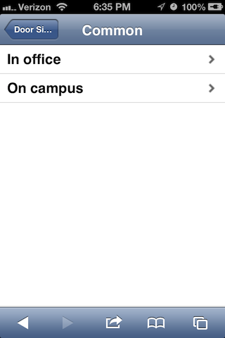

# Tweetable Office Door Sign

## Inspiration and Need

A sizable amount of my work week is spent outside of my office, and is difficult to schedule ahead of time:

- Material testing jobs show up with little notice.
- Students or faculty need help fixing a coding, instrumentation, or other problem, and it’s easiest to fix those on-site rather than in my office.
- etc.
 
I’ve got a spot on my door for a 3x5 index card where I can post my known schedule (classes, regular meetings, that sort of thing), but I’ve always had to keep a stack of Post-It notes on hand for the other places I often go. The problem with the Post-It method is that I’ll often get called off to another location before I can get back to my office, and the notes quickly become inaccurate. And the notes can easily get misplaced or out of order, making them less useful.

And I liked the concept of the [Panic Status Board](http://www.panic.com/blog/2010/03/the-panic-status-board/), too.

So over Christmas break in 2010, I started working on a door sign I can update over the network from my smartphone, my home or office PC, someone else’s computer, etc. My office door already has a 12 inch square window in it, so any display I mount there can be protected, at least when the door is closed.

## Hardware Options

There were several ways I could do this with varying tradeoffs:

- [YBox2](http://www.ladyada.net/make/ybox2/) plus LCD TV and Twitter feed. Pros: would work out of the box for $150 in hardware costs and a bit of assembly and soldering. Cons: without modifying the Twitter widget code, I’d have to worry about the risk of someone else switching my door sign to another Twitter user, or else put the YBox2 on an isolated and firewalled network segment. And I’d have to either learn soldering or beg someone else to put it together for me.
- Two XBee modules, one USB adapter, one compatible character LCD screen, and an always-on computer. Pros: all the customization I’d ever want. Cons: all the customization I’d never want to implement. And more soldering. And by 2013, I no longer had any stationary computers in my office.
- Arduino, Ethernet shield, and firmware to parse an RSS or Twitter feed. Pros: probably easier to customize the firmware than the YBox2. Cons: $100 or more in hardware.
- [#twatch](http://dangerousprototypes.com/docs/Twatch_networked_LCD) as an LCD Smartie display. Pros: super-cheap at $40 assembled. Cons: needing a second network connection on a stationary computer in the office.
- Chumby or other Internet-connected display device. Pros: cheap, especially the $50 Insignia-branded one at Best Buy. Wifi built in. Cons: customization limited to whatever widgets people have already posted, or to my ability to code my own Flash widgets.

I ended up buying an Insignia Chumby because for $50, even if I just made it into a smarter alarm clock with MP3 and FM radio playback, it’d be an improvement over my current home clock. But over the last couple of years, it's worked out well for my door sign. Even with the demise of the Chumby infrastructure earlier this year, I've kept the sign running with the Zurk offline firmware stored on a small flash drive. Whenever the Chumby infrastructure returns, I should be able to switch back without problems.

## Overall Design

1.	Dedicated Twitter account for the door sign. I have an unused personal Twitter account, too, but I want to keep the door sign content separated from anything irrelevant I might post on my personal feed.
2.	Whatever Twitter application I want. For this particular application, I’ll keep a browser logged in to my door sign Twitter account, and point it to a simple page that can fill out a default status on the Twitter website. That way, all I have to do is click one link, optionally edit the status, and hit the Tweet button on the site.
3.	Any clock app with a short play time.
4.	Chumby RSS Reader app with a longer play time. By default, this will let you tap forward and back through a given RSS feed. I could have used the Twitter app, but I really want to keep my sign’s Twitter ID as private as possible. I don’t want to worry about followers, protecting the tweets, etc. If I can get an RSS feed of the tweets, I stand a chance of sanitizing the content so it shows only what I want, in whatever format I want, and nothing more.
5.	Short Python script and cron job that filters my door sign feed, and saves the output somewhere accessible to the RSS Reader app.
6.	Modifying the web server hosting the RSS feed to ensure that the feed doesn’t get cached for more than 1 minute.

## Posting Messages to the Twitter Feed

My primary interface to the sign is my iPhone. I use the [iUI](https://github.com/iui/iUI) framework to avoid having to write a real iOS app, and to have it gracefully degrade when I use a desktop browser.

The main screen looks like this on the iPhone:

and this on Safari:

Drilling down through the iUI menus:

Redirecting to the Twitter site:

After the Tweet is sent:

The core of the posting code are links like:

    <a href="javascript:void(0)"
       onclick="status('In office');">In office</a></li>

with a `status` function of:

    function status(message) {
      var d = new Date();
      var ms = d.getMilliseconds();
      var urlvar = "https://twitter.com/intent/tweet?text="+encodeURI(message+" {"+ms+"}");
      window.location.assign(urlvar);
    }

Since Twitter doesn't like usrs posting identical status messages repeatedly, the `status` function appends a millisecond count to the end of each message. The Python script will have to remove this count before writing the RSS feed for the door sign.

## Server-side Python Script

This started out pretty simple in 2010: grab the last item from a public RSS feed on Twitter, strip out identifying information, add a verbose timestamp to the entry, and write out the modified single-item RSS feed. Later, Twitter deprecated RSS feeds entirely, and I had to write a script that uses the new API, grabs the user account timeline, and creates its own RSS feed from scratch.

To configure the new script:

 - Create a new application at [https://dev.twitter.com](https://dev.twitter.com), get a consumer key and secret, and enter them into doorsign.ini
 - Enter the screen name of the dedicated Twitter account into doorsign.ini (given the new API, we could just pull the authorized timeline with no configuration, but pulling a user timeline lets us poll more often without hitting rate limits)
 - Enter the feed title, feed description, feed link, and item title into doorsign.ini.
 - Run the script once interactively. On a Linux host, this will connect to Twitter to let you authorize the application, and write the OAuth secrets into a hidden credentials file.
 - After the OAuth secrets are written, the script should run normally, and write out the RSS feed.
 - A once-per-minute cron job to run the script could be `(cd /folder && ./script.py)`

## Web Server Modifications

I needed to enable and configure the Apache module `mod_expires`. Since my web server is Debian, all that required was running `a2enmod expires`, adding `ExpiresActive On` and `ExpiresByType application/rss+xml "modification plus 1 minute"` to the Apache virtual host entry, and finally reloading the Apache process.

## Results

Here’s a resulting image from a virtual Chumby:

